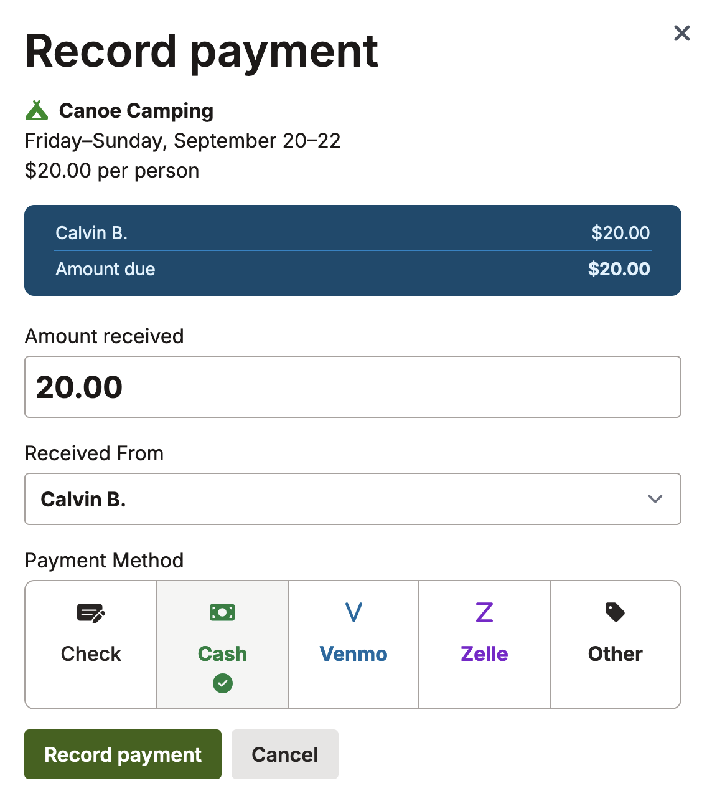

# Recording payments

When you ask your members to pay for events, you can record their payments in Scoutplan.
This helps you keep track of who has paid and who hasn't. It also helps you see how much money you've collected and how much you're still waiting for.
Payment recording only applies to events that [require RSVPs](/docs/collecting_rsvps) and that have a cost associated with them.
If you're not charging for an event, you don't need to record payments.

## Set a cost for your event

1. Navigate to the event you want to record payments for.
1. Click the (...) menu in the top right corner, then click **Event settings**.
1. Turn on the **Requires RSVP** switch.
1. Enter youth and adult costs.
1. Click **Save Changes**.

Payments are calculated based on the entire family of the person attending.
For example, if a family of four is attending an event, and the cost is $10 per person, the total cost for the family is $40.
Hence, you can click on any family member to record the payment for the entire family.

## Receive a payment

You'll be returned to the event page. From here:
1. Click the **See all RSVPs** button.
1. In the leftmost **Accepted** column, you'll see a list of everyone who's planning to attend.
1. Next to each name you'll see a triangle exclamation mark icon. Click the icon to view the Record Payment screen:

1. Enter the amount paid, who you received it from, and the payment method.
1. Click **Record Payment**.
